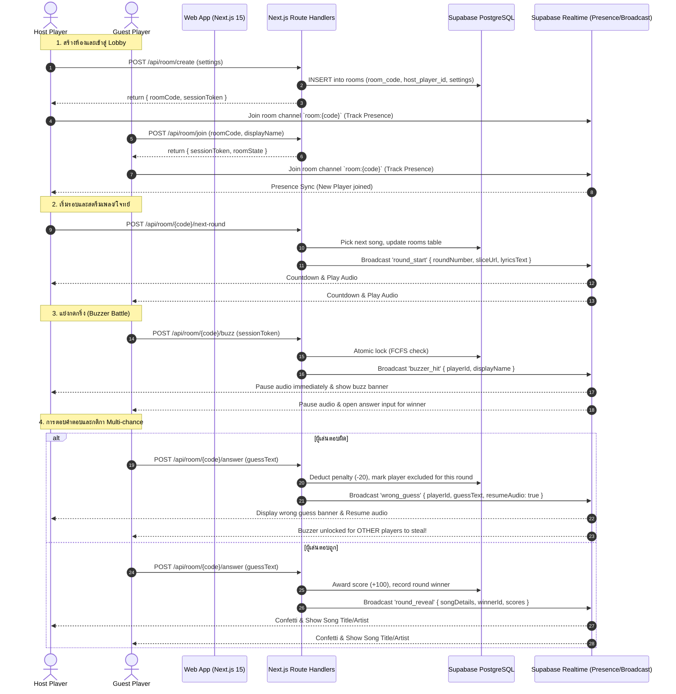

# Design Specification: Phase 4 - ระบบห้องและ Realtime Multiplayer (Pleng-Rai-Wa)

**Date**: 2026-10-04  
**Project**: เพลงไรวะ (Pleng-Rai-Wa)  
**Status**: Approved by User  
**Target Milestone**: Phase 4 - ระบบห้องและ Realtime Multiplayer  

---

## 1. Executive Summary & Objectives

Phase 4 พัฒนาระบบห้องเล่นเกมแบบผู้เล่นหลายคน (Realtime Multiplayer) รองรับทั้งการเล่นในวงเพื่อนผ่านโทรศัพท์มือถือ/คอมพิวเตอร์ และการแสดงผลบนจอใหญ่สไตล์ปาร์ตี้ (TV Party Display Mode) ภายใต้งบประมาณ **0 บาท (100% Free Public Feasibility)** โดยใช้สถาปัตยกรรม **Hybrid Next.js Serverless API + Supabase Realtime (Presence & Broadcast)**

### เป้าหมายหลัก (Key Goals)
1. **Lobby & Room Management**: สร้างห้องด้วยรหัสสุ่ม 6 ตัวอักษร, สร้าง QR Code, คัดลอกลิงก์ชวนเพื่อน, และหน้า Lobby ซิงค์รายชื่อ/สถานะผู้เล่นแบบ Realtime
2. **Host Authority & Game Customization**: สิทธิ์ Host เลือกโหมดการเล่น (Audio Slice, Buzzer Battle, AI Lyrics), เลือกแนวเพลง, กำหนดจำนวนข้อและเวลาตอบ, พร้อมปุ่มโอนสิทธิ์ Host
3. **Server-Authoritative Buzzer & Anti-Cheat**: จัดการแย่งกดกริ่งแบบ First-Come-First-Serve (FCFS) ฝั่ง Server, ตรวจคำตอบลับโดยไม่เปิดเผยชื่อเพลงล่วงหน้าทาง Network
4. **Multi-Chance Party Rule**: กรณีผู้กดกริ่งตอบผิด ระบบจะกระจายข้อความที่ตอบผิดให้ทุกคนเห็นเป็นแนวทาง และเปิดโอกาสให้ผู้เล่นคนอื่นที่เหลือแย่งกดกริ่งตอบต่อ พร้อมสั่งให้เพลงเล่นต่อ
5. **Session Persistence & Auto-Reconnect**: กู้คืนสถานะการเล่น คะแนน และตัวตนเมื่อรีเฟรชหน้าจอ (F5) หรือสัญญาณเน็ตหลุด ผ่าน `localStorage`
6. **TV Party Display Mode**: สวิตช์มุมมองจอใหญ่สำหรับ Host ขยายภาพ Visualizer, คลื่นเสียง, เนื้อเพลง AI, และกระดานคะแนน เพื่อแสดงผลขึ้นจอทีวีหรือโปรเจกเตอร์

---

## 2. Architecture & Data Flow



---

## 3. Database Schema & State Models

### 3.1 Room State (`public.rooms` Extension)
ตาราง `public.rooms` ที่สร้างไว้ใน Migration เบื้องต้นจะถูกใช้งานโดยสมบูรณ์:

```typescript
export interface RoomDatabaseRow {
  id: string;
  room_code: string;
  host_player_id: string;
  status: "lobby" | "playing" | "question_active" | "buzzed" | "revealing" | "game_over";
  settings: RoomSettings;
  current_song_id: string | null;
  played_song_ids: string[];
  created_at: string;
  updated_at: string;
}
```

### 3.2 Dynamic Runtime Room State
สถานะแบบละเอียดของแต่ละรอบ (Active Round Session) บันทึกและซิงค์ผ่าน API + Realtime:

```typescript
export interface ActiveRoundState {
  roundNumber: number;
  totalRounds: number;
  songId: string;
  audioSliceUrl?: string;
  lyricsIntro?: string;
  lyricsChorus?: string;
  lyricsType?: "intro" | "chorus";
  startedAt: string;
  roundTimeoutSec: number;
  buzzedPlayerId: string | null;
  buzzedAt: string | null;
  excludedPlayerIds: string[]; // ผู้เล่นที่ตอบผิดในรอบนี้ (หมดสิทธิ์กดซ้ำ)
  lastWrongGuesses: Array<{
    playerId: string;
    displayName: string;
    answerText: string;
    timestamp: string;
  }>;
  revealedSong?: {
    id: string;
    title: string;
    artist: string;
    releaseYear?: number;
    audioUrl: string;
    hookStartSec?: number;
  };
}
```

---

## 4. API Endpoints Specification

### 4.1 Room Management
1. `POST /api/room/create`
   - **Input**: `{ hostDisplayName: string, settings?: Partial<RoomSettings> }`
   - **Logic**: สุ่มรหัส 6 ตัวอักษร (A-Z, 0-9 ไม่รวมตัวอักษรสับสน เช่น O/0, I/1), บันทึกลงตาราง `rooms`, ออก `sessionToken` และ `playerId`
   - **Output**: `{ success: true, roomCode: string, sessionToken: string, playerId: string }`

2. `POST /api/room/join`
   - **Input**: `{ roomCode: string, displayName: string, existingSessionToken?: string }`
   - **Logic**: ตรวจสอบว่าห้องมีอยู่จริงและยังไม่จบเกม, ตรวจสอบชื่อไม่ให้ซ้ำกับผู้เล่นที่กำลัง Active ในห้อง
   - **Output**: `{ success: true, roomCode: string, sessionToken: string, playerId: string, isHost: boolean }`

3. `GET /api/room/[code]/state`
   - **Query / Header**: `Authorization: Bearer <sessionToken>`
   - **Logic**: คืนค่าสถานะห้องปัจจุบัน, รายชื่อผู้เล่นและคะแนน, ข้อปัจจุบัน (ไม่ส่งเฉลยถ้ายังไม่ reveal) สำหรับการ Reconnect
   - **Output**: `{ room: RoomState, activeRound?: ActiveRoundState, me: Player }`

4. `POST /api/room/[code]/settings`
   - **Input**: `{ sessionToken: string, settings: Partial<RoomSettings>, newHostPlayerId?: string }`
   - **Logic**: ตรวจสอบว่าเป็น Host เท่านั้น, อัปเดต `settings` หรือโอนสิทธิ์ Host, ส่ง Broadcast `settings_updated`

### 4.2 Gameplay & Buzzer Arbitration
1. `POST /api/room/[code]/next-round`
   - **Input**: `{ sessionToken: string }` (Host only)
   - **Logic**: ดึงเพลงถัดไปจากคลังที่ไม่ซ้ำกับ `played_song_ids`, รีเซ็ตสถานะกริ่ง, ส่ง Broadcast `round_start`

2. `POST /api/room/[code]/buzz`
   - **Input**: `{ sessionToken: string }`
   - **Logic**:
     - ตรวจสอบว่ารอบปัจจุบันอยู่ในสถานะเปิดรับกริ่ง (`question_active`)
     - ตรวจสอบว่า `playerId` ไม่อยู่ใน `excludedPlayerIds` (ยังไม่เคยตอบผิดในรอบนี้)
     - ล็อกสิทธิ์ First-Come-First-Serve (FCFS)
     - ส่ง Broadcast `buzzer_hit` ไปยังชาแนล `room:{code}`
   - **Output**: `{ success: true, buzzedPlayerId: string, timeToAnswerSec: 10 }`

3. `POST /api/room/[code]/answer`
   - **Input**: `{ sessionToken: string, answerText: string }`
   - **Logic**:
     - ตรวจสอบว่าผู้ส่งคำตอบคือคนที่กดกริ่งติด (`buzzedPlayerId`)
     - ตรวจสอบความถูกต้องด้วย `isFuzzyMatch(answerText, song.title, song.aliases)`
     - **ถ้าถูก**: เพิ่มคะแนน +100, เปลี่ยนสถานะเป็น `revealing`, ส่ง Broadcast `round_reveal`
     - **ถ้าผิด**: หักคะแนน -20, เพิ่ม `playerId` ลงใน `excludedPlayerIds`, บันทึก `wrongGuesses`, สั่งปลดล็อกกริ่งให้ผู้อื่น และส่ง Broadcast `wrong_guess` พร้อมคำสั่งเล่นเสียงต่อ
   - **Output**: `{ isCorrect: boolean, feedback: string, scoreDelta: number }`

---

## 5. User Interface & Display Modes

### 5.1 Route: `/room/[code]`
หน้าจอเดียวที่ปรับเปลี่ยนตาม State อัตโนมัติ:
- **Lobby State**:
  - รหัสห้องขนาดใหญ่ 6 หลัก พร้อมปุ่ม Copy Link & QR Code Modal
  - ตารางผู้เล่น (Cards Grid) พร้อมป้าย Host, Avatar, ชื่อเล่น, สถานะ Ready
  - Host Settings Drawer/Card สำหรับปรับโหมด (Audio Slice, Buzzer, AI Lyrics), จำนวนข้อ, แนวเพลง
  - ปุ่มพร้อม (Ready) และปุ่มเริ่มเกม (Start Game)
- **Active Gameplay State (Player View)**:
  - Header: ข้อที่ X/Y, หลอดเวลาถอยหลัง, คะแนนส่วนตัว
  - Audio Player / AI Lyrics Visualizer
  - **Big Buzzer Button**: ปุ่มกริ่งขนาดใหญ่ มีไฟวิ่ง กดง่ายด้วยนิ้วโป้ง (Mobile) หรือ Spacebar (Desktop)
  - Answer Input Popup: เด้งขึ้นมาทันทีเมื่อกดกริ่งติด รองรับ Autocomplete และ Free-text
  - Wrong Guess Banner: แถบข้อความแจ้งเตือนสีส้มแดงเมื่อมีคนตอบผิด แสดงชื่อและคำตอบที่ทายผิด
- **Reveal State**:
  - การ์ดเฉลยเพลงพร้อมชื่อเพลง, ศิลปิน, ปี, ปก และปุ่มฟังเพลงท่อนฮุกเต็ม
  - อัปเดตกระดานคะแนนสด พร้อมเอฟเฟกต์อันดับเปลี่ยน
- **Game Over State**:
  - แท่นรับรางวัล Podium 1st, 2nd, 3rd
  - แสดงสถิติ (คนกดกริ่งเร็วที่สุด, คนเดาผิดบ่อยที่สุด)
  - ปุ่มกลับสู่ Lobby หรือเริ่มรอบใหม่

### 5.2 TV Party Display Mode (`/room/[code]?view=tv`)
- สำหรับ Host เปิดบนหน้าจอ Smart TV / Projector / จอแยก
- ซ่อนปุ่มกริ่งและช่องกรอกคำตอบ
- ขยาย Visualizer ขนาดใหญ่สะใจ
- แถบ Scoreboard ด้านข้างแสดงคะแนนผู้เล่นทุกคนแบบสด
- แบนเนอร์แสดงคนกดกริ่ง และกล่องข้อความเฉลย/ทายผิดขนาดใหญ่ อ่านง่ายจากระยะไกล

---

## 6. Resilience, Reconnection & Anti-Cheat

1. **LocalStorage Session Persistence**:
   - คีย์: `pleng_session_token`, `pleng_room_code`, `pleng_display_name`
   - เมื่อรีเฟรชหน้าจอ (F5) หรือปิดเปิดแท็บใหม่ ตัวเครื่องจะ Reconnect กับเซสชันเดิมโดยไม่เสียคะแนนและไม่ถูกสร้างผู้เล่นซ้ำ
2. **Automatic Host Migration**:
   - หาก Host ตัดการเชื่อมต่อเกิน 15 วินาที สิทธิ์ Host จะถูกถ่ายโอนไปยังผู้เล่นที่เชื่อมต่ออยู่คนแรกโดยอัตโนมัติ
3. **Anti-Cheat by Design**:
   - ข้อมูลชื่อเพลงจริงจะไม่ถูกส่งไปที่ฝั่ง Client ในช่วงเล่นเด็ดขาด ตรวจสอบคำตอบผ่าน Next.js Serverless API เท่านั้น

---

## 7. Verification & Acceptance Criteria

- [ ] สร้างห้องและได้รหัส 6 หลัก พร้อมปุ่มคัดลอกลิงก์และแสดง QR Code ใช้งานได้จริง
- [ ] เปิด 2-3 หน้าต่าง (Incognito / มือถือ) เข้าร่วมห้องเดียวกันได้ รายชื่อและสถานะ Ready ซิงค์ทันที
- [ ] สิทธิ์ Host ปรับเปลี่ยนการตั้งค่าห้อง และสามารถโอนสิทธิ์ให้ผู้อื่นได้
- [ ] กดเริ่มเกม เพลงเริ่มเล่นพร้อมกันทุกเครื่อง
- [ ] กดกริ่ง: เครื่องแรกที่กดได้สิทธิ์ตอบ เสียงเพลงหยุดทุกเครื่อง และเครื่องอื่นถูกล็อกปุ่มกริ่ง
- [ ] ทายผิด: ข้อความคำตอบที่ผิดปรากฏบนทุกจอ, ผู้ตอบผิดถูกหักคะแนน, เพลงเล่นต่อ, และผู้เล่นอื่นกดกริ่งแย่งตอบต่อได้
- [ ] ทายถูก / หมดเวลา: หน้าจอเฉลยเพลงพร้อมข้อมูลครบถ้วน และคะแนนอัปเดตแบบ Realtime
- [ ] หน้าจอ TV Party Mode (`?view=tv`) แสดงผลสะอาดตา ตัวอักษรใหญ่ เหมาะกับจอทีวี
- [ ] กด F5 รีเฟรชหน้าจอ ผู้เล่นกลับเข้าห้องเดิมได้ต่อเนื่อง คะแนนไม่หาย
