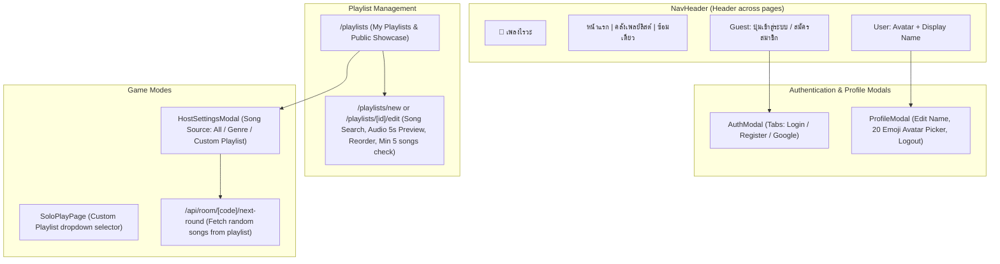

# Phase 5: ระบบสมาชิกและ Custom Playlists — Architecture & Design Spec

**Project:** เพลงไรวะ (Pleng-Rai-Wa)  
**Date:** 2026-10-05  
**Status:** Approved Design  
**Author:** Antigravity & User  

---

## 1. Overview & Objective

Phase 5 introduces persistent user identity and user-curated content into Pleng-Rai-Wa:
1. **User Authentication & Profiles (5.1):** Supabase Auth supporting Email/Password and Google OAuth, maintaining a Guest-First architecture (unauthenticated users play immediately with zero barriers), and persistent user profiles (`display_name`, curated emoji avatar).
2. **Custom Playlist Management (5.2):** Creating, editing, ordering, and sharing playlists from the public song library, with Public/Private visibility controls, minimum 5-song gameplay validation, and seamless integration into both Multiplayer Room Settings and Solo Practice mode.

---

## 2. Core Constraints & Guarantees

1. **100% Free Public Feasibility:** Runs on Supabase Free Tier (50,000 MAU, unlimited social OAuth, Postgres RLS) + Vercel Hobby Tier. Zero paid services.
2. **Guest-First Non-Intrusiveness:** Any visitor can join or create multiplayer rooms and play solo as a Guest without being forced to log in. Login is only prompted when creating/saving custom playlists or wanting persistent profile stats.
3. **Anti-Cheat Integrity:** Secret song metadata from custom playlists remains protected by server-side sanitization prior to round reveal (`revealing` status).
4. **Mobile Touch Ergonomics:** Touch targets $\ge 44\text{px}$, responsive song reordering, and audio preview controls.

---

## 3. Database Architecture & Schema Changes

### 3.1 Migration: `20261005_profiles_and_playlists.sql`

```sql
-- 1. Profiles Table
CREATE TABLE IF NOT EXISTS public.profiles (
    id UUID PRIMARY KEY REFERENCES auth.users(id) ON DELETE CASCADE,
    display_name TEXT NOT NULL,
    avatar TEXT NOT NULL DEFAULT '🦊',
    created_at TIMESTAMPTZ DEFAULT NOW(),
    updated_at TIMESTAMPTZ DEFAULT NOW()
);

-- Enable RLS
ALTER TABLE public.profiles ENABLE ROW LEVEL SECURITY;

-- Profiles Policies
CREATE POLICY "Allow public read for profiles" ON public.profiles
    FOR SELECT USING (true);

CREATE POLICY "Allow users to update own profile" ON public.profiles
    FOR UPDATE USING (auth.uid() = id)
    WITH CHECK (auth.uid() = id);

CREATE POLICY "Allow users to insert own profile" ON public.profiles
    FOR INSERT WITH CHECK (auth.uid() = id);

-- Trigger for Auto-Creating Profile on auth.users Signup
CREATE OR REPLACE FUNCTION public.handle_new_user()
RETURNS TRIGGER AS $$
BEGIN
    INSERT INTO public.profiles (id, display_name, avatar)
    VALUES (
        NEW.id,
        COALESCE(
            NEW.raw_user_meta_data->>'full_name',
            NEW.raw_user_meta_data->>'name',
            split_part(NEW.email, '@', 1),
            'นักฟังเพลง'
        ),
        '🦊'
    )
    ON CONFLICT (id) DO NOTHING;
    RETURN NEW;
END;
$$ LANGUAGE plpgsql SECURITY DEFINER;

DROP TRIGGER IF EXISTS on_auth_user_created ON auth.users;
CREATE TRIGGER on_auth_user_created
    AFTER INSERT ON auth.users
    FOR EACH ROW EXECUTE FUNCTION public.handle_new_user();

-- Trigger for updated_at
DROP TRIGGER IF EXISTS set_profiles_updated_at ON public.profiles;
CREATE TRIGGER set_profiles_updated_at
    BEFORE UPDATE ON public.profiles
    FOR EACH ROW
    EXECUTE FUNCTION update_updated_at_column();
```

### 3.2 Playlists & Playlist Songs Schema Alignment
Ensure `user_id` in `playlists` cleanly matches Supabase auth UUIDs and RLS allows:
- `SELECT`: Public can read `is_public = true`; authenticated users can read their own `user_id = auth.uid()::text`.
- `INSERT`: Authenticated users can insert with `auth.uid()::text = user_id`.
- `UPDATE`/`DELETE`: Authenticated owners only.
- `playlist_songs`: Read permitted if parent playlist is readable; Insert/Delete permitted if caller owns parent playlist.

---

## 4. Component & UI Architecture



### 4.1 Authentication Context & Modals
- **`useAuth` Hook (`src/hooks/use-auth.ts`)**:
  - Subscribes to `supabase.auth.onAuthStateChange`.
  - Exposes `user`, `profile`, `isLoading`, `signInWithPassword`, `signUpWithPassword`, `signInWithGoogle`, `signOut`, `updateProfile`.
- **`AuthModal` (`src/components/auth/auth-modal.tsx`)**:
  - Tab 1: เข้าสู่ระบบ (Email / Password)
  - Tab 2: สมัครสมาชิก (Email / Password / Confirm Password)
  - Google OAuth One-Click Button
  - Error messages (Wrong password, Email in use, Weak password).
- **`ProfileModal` (`src/components/auth/profile-modal.tsx`)**:
  - Name input (1-30 chars)
  - Emoji Avatar grid (20 musical/animal icons)
  - Log out button.

### 4.2 Custom Playlist Management
- **`src/app/playlists/page.tsx`**:
  - Tabbed or sectioned view: "เพลย์ลิสต์ของฉัน" and "เพลย์ลิสต์สาธารณะ"
  - Action button: "+ สร้างเพลย์ลิสต์ใหม่" (checks auth; opens AuthModal if guest)
  - Cards show title, author, song count, duration, "เล่นในห้อง" or "เล่นคนเดียว"
- **`src/app/playlists/editor-view.tsx` (Used in New & Edit)**:
  - Header: Title, Description, IsPublic toggle.
  - Song Search Bar: Realtime query against `songs` table with audio preview button.
  - Selected Songs List: Shows order number, title, artist, duration, move up/down, remove.
  - Save button with validation: Requires title and $\ge 5$ songs.

### 4.3 Gameplay Integration
- **`HostSettingsModal`**:
  - Adds "แหล่งเพลง: สุ่มทั้งหมด / หมวดหมู่ / Custom Playlist"
  - If Custom Playlist is chosen, renders dropdown listing accessible playlists.
  - Passes `playlistId` in `prepareSettingsPayload`.
- **`SongService.getRandomSongs`**:
  - Enhanced to query `playlist_songs` join when `options.playlistId` is provided.

---

## 5. Security & Verification Plan

1. **RLS Verification:**
   - Script verifies guest cannot insert or update playlists.
   - Script verifies user A cannot edit user B's private playlist.
   - Script verifies unauthenticated requests can view public playlists.
2. **Gameplay Anti-Cheat:**
   - Secret song titles from custom playlists are not leaked to players before round reveal.
3. **End-to-End Build:**
   - `npm run build` and `npx tsc --noEmit` pass with zero errors.
