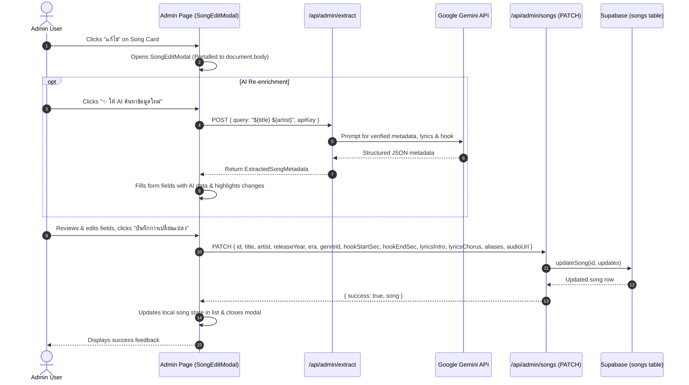

# Admin Song Edit and AI Re-enrichment Design

- **Date**: 2026-10-08
- **Status**: Approved
- **Author**: Antigravity Assistant & Pleng-Rai-Wa Team

---

## 1. Overview & Problem Statement

In the admin song library (`/admin` - Tab "คลังเพลงทั้งหมด"), administrators can currently view, play, audit audio, sync audio from YouTube, and delete songs. However, there is no way to edit song metadata (titles, artists, genres, eras, release years, hook timings, and lyrics) if the existing information is inaccurate or incomplete.

Administrators need:
1. An **Edit** action on each song card to manually adjust any metadata.
2. A **"✨ ให้ AI ค้นหาข้อมูลใหม่"** (AI Re-enrichment) capability inside the edit modal to automatically look up and populate the most accurate metadata and lyrics using Gemini API, allowing the administrator to review and tweak before saving.

---

## 2. Architecture & Data Flow



---

## 3. Backend Specification (`PATCH /api/admin/songs`)

### Endpoint
- **URL**: `/api/admin/songs`
- **Method**: `PATCH`
- **Headers**: `Content-Type: application/json`

### Request Body
```typescript
interface UpdateSongRequestBody {
  id: string; // Required UUID
  title?: string;
  artist?: string;
  aliases?: string[];
  releaseYear?: number;
  genreId?: string;
  era?: string;
  hookStartSec?: number;
  hookEndSec?: number;
  durationSec?: number;
  lyricsIntro?: string;
  lyricsChorus?: string;
  audioUrl?: string;
}
```

### Response
- **200 OK**:
  ```json
  {
    "success": true,
    "song": {
      "id": "uuid",
      "title": "วัดใจ",
      "artist": "Silly Fools",
      "aliases": ["wat jai"],
      "releaseYear": 2004,
      "genreId": "genre-uuid",
      "era": "2000s",
      "hookStartSec": 68,
      "hookEndSec": 94,
      "lyricsIntro": "...",
      "lyricsChorus": "...",
      "audioUrl": "https://..."
    }
  }
  ```
- **400 Bad Request**: When `id` is missing or invalid.
- **500 Internal Server Error**: Database update error.

---

## 4. Frontend Component Design (`SongEditModal`)

A modular React component placed in [`src/components/admin/song-edit-modal.tsx`](file:///D:/pleng-rai-wa/src/components/admin/song-edit-modal.tsx) to prevent bloating [`src/app/admin/page.tsx`](file:///D:/pleng-rai-wa/src/app/admin/page.tsx):

### Key Features
1. **React Portal**: Rendered directly in `document.body` with `z-[100]` and `bg-stone-950/70 backdrop-blur-md` to avoid CSS stacking context overlap issues.
2. **AI Re-enrichment Button**:
   - Triggers `fetch("/api/admin/extract")` using current song's `title` and `artist`.
   - Populates fields automatically: `title`, `artist`, `aliases`, `releaseYear`, `era`, `genreId` (matching `genreSlug` with genre list), `hookStartSec`, `hookEndSec`, `lyricsIntro`, `lyricsChorus`.
   - Visual indicator showing which fields were newly populated or updated by AI.
3. **Form Fields**:
   - **General Info**: Title, Artist, Release Year (number), Era (dropdown: `80s`, `90s`, `2000s`, `2010s`, `2020s`), Genre (dropdown of all available genres).
   - **Aliases Tag Manager**: Add / remove keyword aliases.
   - **Hook Timing**: Start (sec), End (sec), calculated duration, and instant audio preview playback if audio URL exists.
   - **Lyrics Section**: Lyrics Intro textarea, Lyrics Chorus textarea.
   - **Audio URL**: Editable audio stream/file URL with preview play button.
4. **Validation**:
   - Title and Artist must not be empty.
   - Hook End must be greater than or equal to Hook Start.
5. **UI Integration**:
   - On the song cards in Tab 2, an **Edit** button with `Pencil` icon is added beside "โหลดเสียง" and "ลบเพลง".

---

## 5. Error Handling & Edge Cases

1. **AI Extraction Fails or Rate Limits**: Show clear error message in the modal without resetting existing manually typed fields.
2. **Missing Genre Match**: If AI suggests a genre slug not in the database, fallback to the existing genre or prompt the admin.
3. **Empty Song ID**: Handled with 400 error.
4. **Live Audio Testing**: The edit modal includes an audio preview toggle for the edited hook start/end seconds so admins can verify timestamps immediately.

---

## 6. Verification Plan

1. **Type Check**: `npx tsc --noEmit` returns 0 errors.
2. **Production Build**: `npm run build` succeeds.
3. **API Testing**: Test `PATCH /api/admin/songs` via curl/Fetch with field updates.
4. **AI Re-extract Testing**: Test AI lookup on a song with missing/sparse lyrics and verify auto-fill into the form.
5. **Save & Refresh**: Verify database persistence and instant UI reflection.
