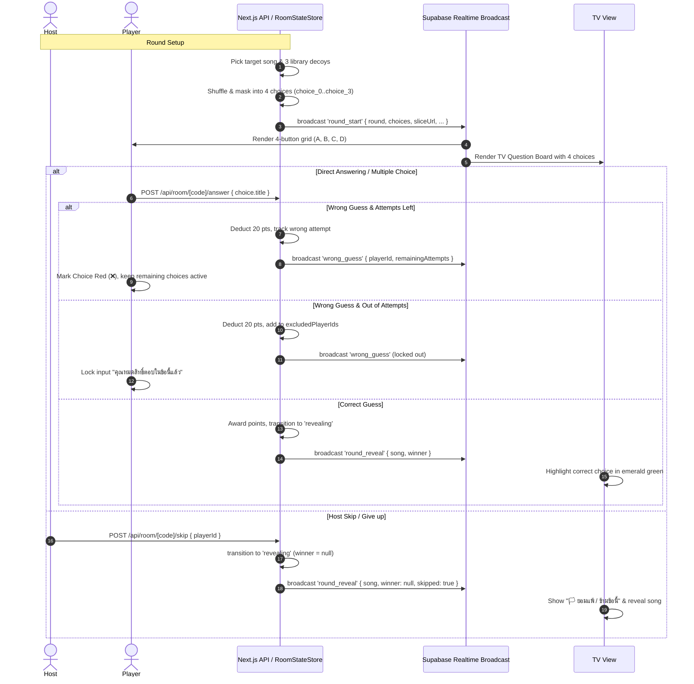

# Design Document: Multiple Choice Mode, Configurable Max Wrong Guesses, and Skip/Give-up

**Date**: 2026-10-08  
**Status**: Draft  
**Branch**: `main`

---

## 1. Overview & Goals

This specification outlines the technical design for three complementary gameplay enhancements in **เพลงไรวะ (Pleng-Rai-Wa)**:

1. **Multiple Choice Mode (ปรนัย 4 ตัวเลือก)**:
   - Provides a 4-choice answering mechanic (1 correct answer + 3 decoys randomly selected from the song library).
   - Works across all game modes (`audio-slice`, `ai-lyrics`, `translated-lyrics`, and `buzzer`).
   - Displays a clean 2x2 grid on player devices and a stylish game show question board on the TV view.
   - Includes anti-cheat safeguards preventing clients from discovering the correct song ID via DevTools or network payloads.

2. **Configurable Max Wrong Guesses (จำนวนครั้งตอบผิดได้ต่อข้อ)**:
   - Host can configure how many wrong guesses are permitted per round:
     - `1 ครั้ง (ค่าเริ่มต้น)`: ตอบผิดแล้วหมดสิทธิ์ในข้อนั้นทันที
     - `2 ครั้ง`: ให้โอกาสแก้ตัว 1 ครั้ง
     - `3 ครั้ง`: ให้โอกาสแก้ตัว 2 ครั้ง
     - `ไม่จำกัด (Unlimited)`: ตอบผิดได้เรื่อยๆ จนกว่าจะหมดเวลาหรือมีคนตอบถูก
   - **Score Penalty**: Every wrong guess continues to deduct 20 points (score clamped at a minimum of 0) to deter spamming.
   - **Buzzer Mode Guardrail**: In `buzzer` mode, buzzing in grants strictly 1 attempt per buzz to release the lock and allow competitors to buzz in.

3. **Skip / Give-up Feature (ยอมแพ้ / ข้ามไปข้อถัดไป)**:
   - Host can click "🏳️ ยอมแพ้ / ข้ามข้อนี้" at any time during `question_active` or `buzzed` to end the current question and reveal the answer immediately (no winner / no points awarded).
   - In direct answer modes, individual players can also choose "🏳️ ยอมแพ้ข้อนี้" to forfeit their attempts. If all room participants forfeit or exhaust their attempts, the round automatically transitions to `revealing`.

---

## 2. Architecture & Data Flow



---

## 3. Detailed Component Specifications

### 3.1 Type Definitions (`src/types/index.ts`)

```typescript
export type AnswerInputMode = "autocomplete" | "free-text" | "multiple-choice";

export interface ChoiceOption {
  id: string;      // Masked key, e.g. "choice_0", "choice_1", "choice_2", "choice_3"
  title: string;   // Song title displayed to user
  artist: string;  // Song artist
}

export interface RoomSettings {
  // ... existing fields
  answerInputMode: AnswerInputMode;
  maxWrongGuesses?: number; // 0 = unlimited, 1 = 1 time (default), 2 = 2 times, 3 = 3 times
}

export interface ActiveQuestion {
  sliceUrl?: string;
  durationSec?: number;
  lyrics?: string;
  startedAt?: string;
  choices?: ChoiceOption[];
}
```

### 3.2 Decoy Generation & Anti-Cheat (`src/app/api/room/[code]/next-round/route.ts`)

When `settings.answerInputMode === "multiple-choice"`:
1. Target song is selected via `SongService.getRandomSongs(1, filter)`.
2. 3 decoy songs are selected:
   - Query `SongService.getRandomSongs(3, { ...filter, excludeIds: [song.id, ...playedSongIds] })`.
   - If fewer than 3 decoys are returned (e.g. small playlist or narrow genre filter), fallback to general songs table: `SongService.getRandomSongs(3 - count, { excludeIds: [song.id, ...alreadyFetchedDecoyIds] })`.
3. The 4 songs are mapped to `ChoiceOption`:
   ```typescript
   const rawChoices = [
     { realId: song.id, title: song.title, artist: song.artist },
     ...decoys.map(d => ({ realId: d.id, title: d.title, artist: d.artist }))
   ];
   // Fisher-Yates shuffle
   const shuffled = shuffle(rawChoices);
   // Mask ID to prevent DevTools cheat comparison with audio slice URL
   const choices: ChoiceOption[] = shuffled.map((c, idx) => ({
     id: `choice_${idx}`,
     title: c.title,
     artist: c.artist
   }));
   ```
4. `choices` is included in the `round_start` broadcast payload and returned in the HTTP response.

### 3.3 Authoritative State Management (`src/lib/room-state-store.ts`)

1. **State Tracking**:
   - `RoomRoundState`:
     ```typescript
     choices?: ChoiceOption[];
     playerWrongCounts: Record<string, number>; // playerId -> count
     ```
   - On `initRound`, reset `playerWrongCounts = {}` and attach `choices`.

2. **Direct Answer Validation Guard**:
   - Fix existing bug: ensure `isDirectAnswer` checks `gameMode !== "buzzer" && state.roundStatus === "question_active"` so that `audio-slice`, `ai-lyrics`, and `translated-lyrics` all support direct submission.

3. **Configurable Wrong Guess Evaluation**:
   - In `submitAnswer()`:
     ```typescript
     const maxWrong = state.settings?.maxWrongGuesses ?? 1;
     const currentWrongCount = (state.playerWrongCounts[playerId] || 0) + 1;
     state.playerWrongCounts[playerId] = currentWrongCount;

     // Score deduction
     const currentScore = state.scores[playerId] || 0;
     state.scores[playerId] = Math.max(0, currentScore - 20);

     // Check exclusion
     if (isStandardBuzzer) {
       // Buzzer mode: always 1 attempt per buzz to give others a chance
       if (!state.excludedPlayerIds.includes(playerId)) {
         state.excludedPlayerIds.push(playerId);
       }
     } else {
       // Direct answer modes:
       if (maxWrong > 0 && currentWrongCount >= maxWrong) {
         if (!state.excludedPlayerIds.includes(playerId)) {
           state.excludedPlayerIds.push(playerId);
         }
       }
     }
     ```
   - If `totalPlayers` is provided and `state.excludedPlayerIds.length >= totalPlayers`, automatically transition to `roundStatus = "revealing"` with `winnerPlayerId = null`.

### 3.4 Skip / Give-up API Route (`src/app/api/room/[code]/skip/route.ts`)

- **Method**: `POST`
- **Body**: `{ playerId: string }`
- **Logic**:
  1. Validate room code and caller player.
  2. Caller must be the host (or any active player if solo).
  3. If room is in `question_active` or `buzzed`:
     - Transition `roundStatus = "revealing"`.
     - Set `winnerPlayerId = null`.
     - Broadcast `round_reveal` with `{ song: fullSong, winnerPlayerId: null, skipped: true, scores: state.scores }`.
     - Update room DB status to `"revealing"`.
     - Return `{ success: true, message: "ข้ามข้อนี้เรียบร้อยแล้ว" }`.

### 3.5 Player Interface (`src/components/room/game-view.tsx` & `answer-modal.tsx`)

1. **Multiple Choice Grid (Direct Modes)**:
   - When `answerInputMode === "multiple-choice"`, render a 2x2 grid (responsive 1-col on xs mobile, 2-col on sm+).
   - 4 button cards labeled **A**, **B**, **C**, **D**:
     - Large clickable card with vinyl cafe styling (amber border, hover highlight, active press feedback).
     - Subtitle showing artist name.
     - Disabled state if player is excluded or while submitting.
     - When clicked, immediately calls `handleSubmitAnswer(choice.title)`.
     - Incorrect choices for this round are highlighted in subtle muted red with a `❌` badge and disabled for that player so they don't click it again.
2. **Multiple Choice inside Buzzer Modal (`answer-modal.tsx`)**:
   - If `inputMode === "multiple-choice"`, render the 4 choice cards inside the modal with countdown timer. Clicking a choice immediately submits.
3. **Host Skip Button & Player Forfeit**:
   - In `game-view.tsx`, render a clean button alongside the hint bar:
     - For Host: `[🏳️ ข้ามข้อนี้ (ยอมแพ้)]` -> calls `POST /api/room/[code]/skip`.
     - For non-host player in direct mode: `[🏳️ ยอมแพ้ข้อนี้]` -> forfeits current question attempts.

### 3.6 Big Screen Display (`src/components/room/tv-view.tsx`)

1. When `answerInputMode === "multiple-choice"` and `status === "question_active"` or `"buzzed"`:
   - Render a prominent 2x2 Question Board with choices A, B, C, D (titles and artists).
2. When `status === "revealing"`:
   - Highlight the correct choice card with emerald green glow and glowing border.
   - If the question was skipped, show the headline "🏳️ ข้ามข้อนี้ / ยอมแพ้ (ไม่มีใครได้คะแนน)".

### 3.7 Host Settings Modal (`src/components/room/host-settings-modal.tsx`)

1. **Answer Input Mode Selector**:
   - Add 3rd option card:
     - Title: `🔘 Multiple Choice (ปรนัย 4 ตัวเลือก)`
     - Description: `สุ่มตัวเลือกหลอก 3 เพลง รวมเพลงจริงเป็น 4 ช้อยส์ กดตอบได้ทันที`
2. **Allowed Wrong Guesses Selector**:
   - Section header: `❌ จำนวนครั้งที่ตอบผิดได้ต่อข้อ (Max Wrong Guesses)`
   - 4 options:
     - `1 ครั้ง (ค่าเริ่มต้น - ตอบผิดแล้วหมดสิทธิ์)`
     - `2 ครั้ง (แก้ตัวได้ 1 ครั้ง)`
     - `3 ครั้ง (แก้ตัวได้ 2 ครั้ง)`
     - `ไม่จำกัด (Unlimited - ตอบผิดได้เรื่อยๆ)`
   - Explanatory note: `*หมายเหตุ: ในโหมดกดกริ่ง (Buzzer) จะให้ตอบได้ 1 ครั้งต่อการกด เพื่อเปิดโอกาสให้ผู้อื่นแย่งกดตอบ`

---

## 4. Verification & Testing Strategy

1. **Unit Tests**:
   - Test `RoomStateStore.submitAnswer`:
     - Test direct answering in `audio-slice`, `ai-lyrics`, `translated-lyrics`.
     - Test `maxWrongGuesses = 0` (unlimited): wrong guess decrements score by 20, but player is NOT in `excludedPlayerIds`.
     - Test `maxWrongGuesses = 2`: player is only excluded after 2 wrong attempts.
     - Test `buzzer` mode: player is excluded after 1 wrong attempt regardless of `maxWrongGuesses`.
   - Test decoy generation in `next-round`:
     - Generates exactly 4 choices (1 target + 3 decoys).
     - No duplicates between choices.
     - Choice IDs are masked (`choice_0`..`choice_3`).
   - Test Skip API:
     - Verify transition to `revealing` with `winnerPlayerId = null`.
2. **Type Safety & Lint**:
   - `npx tsc --noEmit` returns 0 errors.
3. **Git Commit**:
   - Commit spec and all changes with descriptive commit messages.
